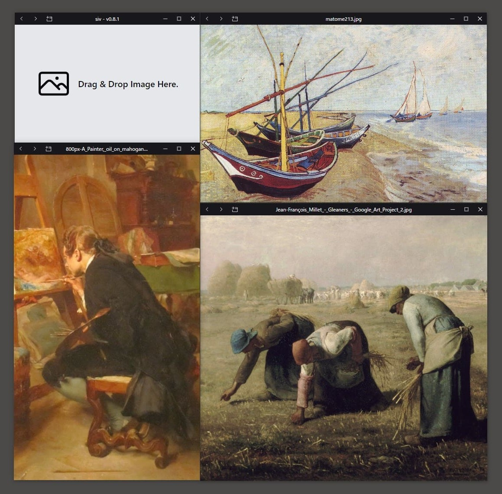

# SIV - Simple Image Viewer

SIV is a simple image viewer made with Tauri and SolidJS.



## 🚀 Features

- [x] Minimalistic UI - Image and only small control bar on top.
- [x] Multiple windows.
- [x] Open from OS file explorer/finder.
- [x] Open from shell command (e.g. siv.exe /path/to/file.png).
- [x] Open with Drop & Drop image on window.
- [x] Zoom in/out with mouse wheel.
- [x] Move position of image by dragging in window.
- [x] Traversing images in folder.
- [x] Supports file formats: `png`, `jpg`, `jpeg`, `webp`, `svg`, `gif`, `avif`, `jpe`, `jif`, `jfif`
- [x] Keyboard shortcuts.
- [ ] Open with file dialog.
- [ ] Tile windows.

## ⌨️ Shortcuts

| Commands                  | Functions                   |
| ------------------------- | --------------------------- |
| +, z, f, Mouse wheel up   | Zoom in                     |
| -, x, d, Mouse wheel down | Zoom out                    |
| ArrowRight, >, n          | Next image in directory     |
| ArrowLeft, <, p           | Previous image in directory |
| j                         | Move down image position    |
| k                         | Move up image position      |
| l                         | Move right image position   |
| h                         | Move left image position    |
| o                         | Open new window             |

## ⛏️ Development

```bash
# dev
pnpm tauri dev
# build
pnpm tauri build
# release
pnpm release
```
